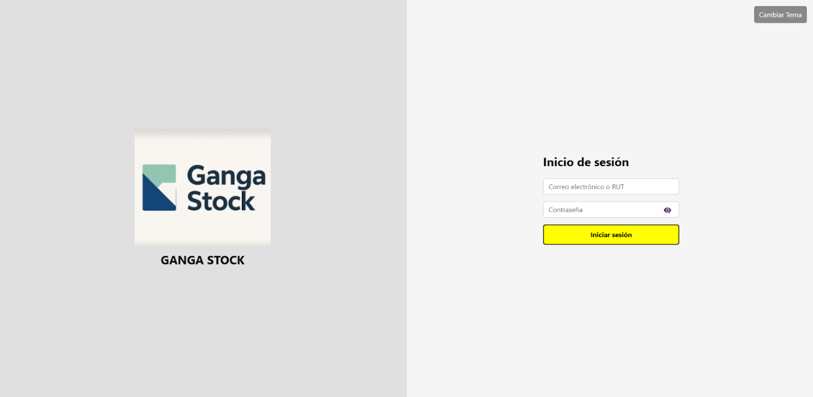
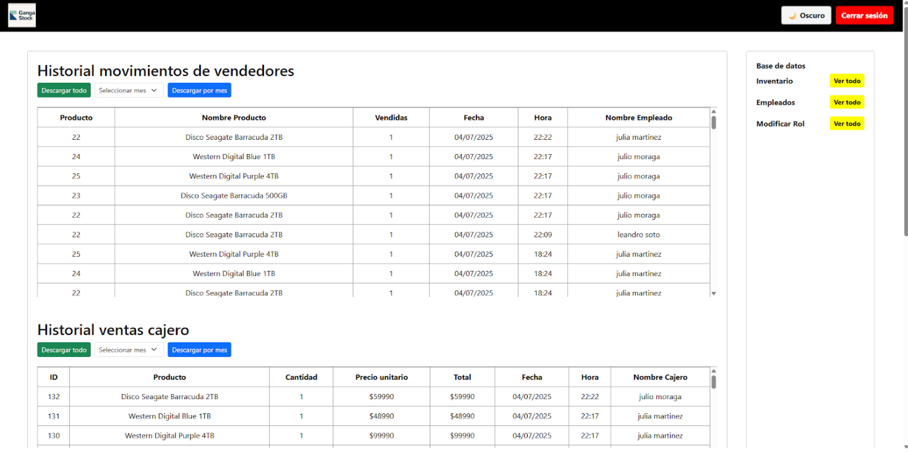
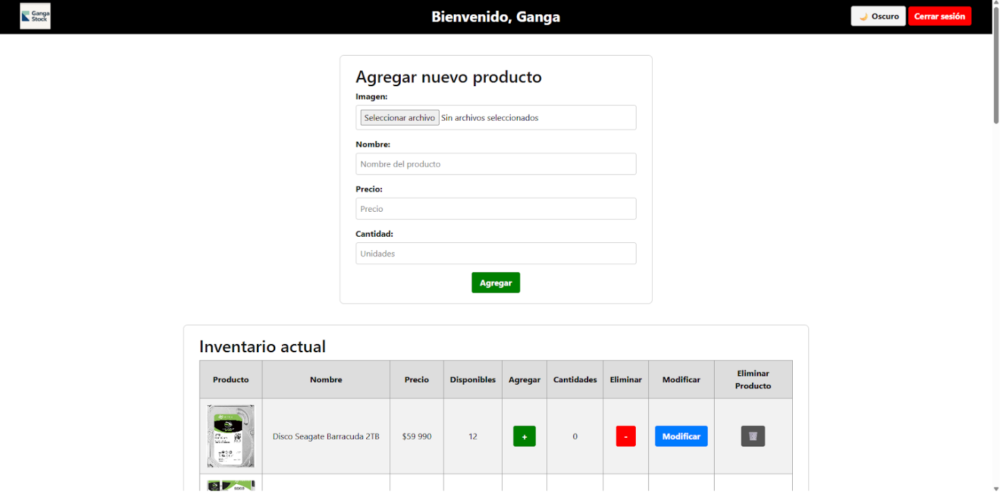
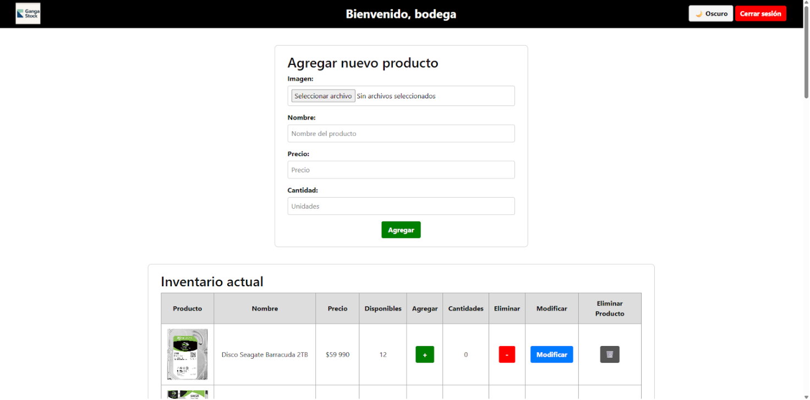
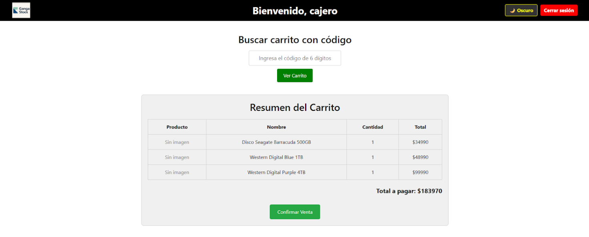
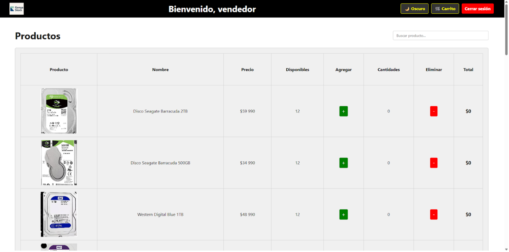
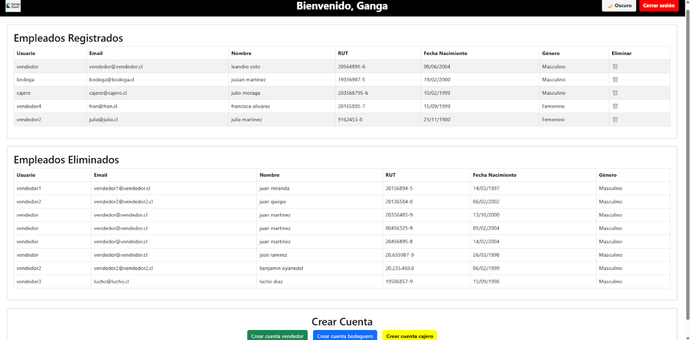
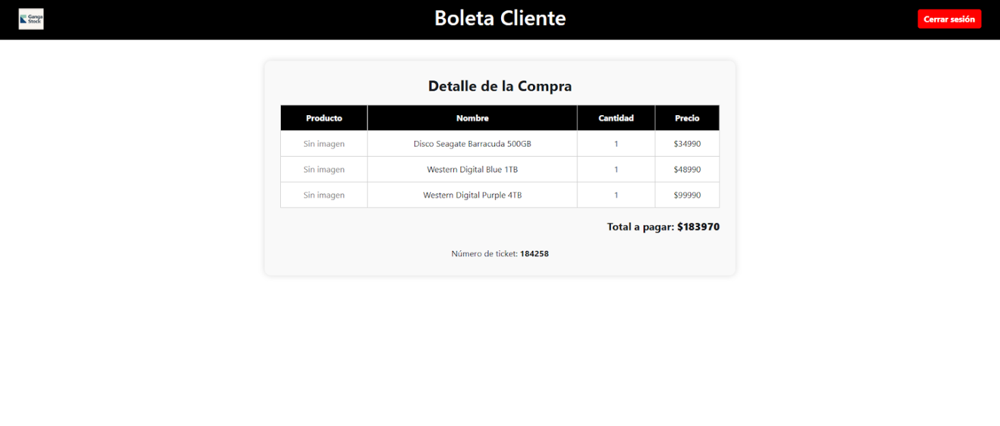
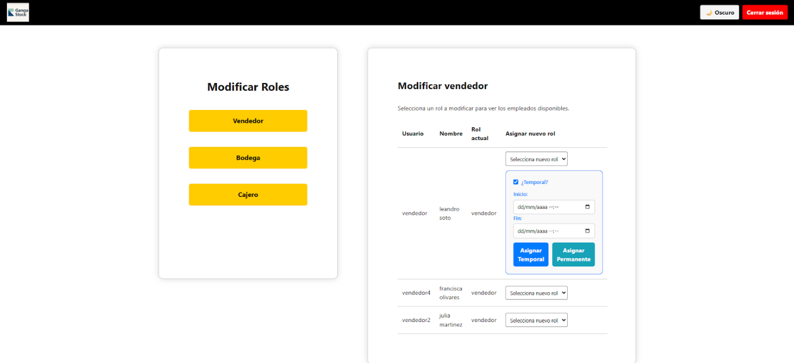

Ganga-Stock es una aplicación web desarrollada en Django para la administración de inventario, ventas y usuarios con distintos roles dentro de una empresa. El sistema permite controlar productos, stock, procesos de venta y gestión de empleados de forma centralizada y eficiente.

Funcionalidades principales:
Sistema de autenticación con redirección según rol (administrador, cajero, bodega, vendedor)
Gestión de productos con imágenes, precios y stock en tiempo real (CRUD)
Control de entradas y salidas de inventario
Módulo de ventas con carrito, confirmación en caja y generación de boletas
Reportes dinámicos de ventas e inventario con exportación a Excel
Administración de empleados y gestión de roles permanentes y temporales
Panel administrativo para supervisión de operaciones

Vistas principales del sistema:
index.html → pantalla de inicio con login y registro de usuarios
index_admin.html → panel administrativo con gestión de inventario, usuarios y reportes
index_empleado.html → interfaz según rol (cajero, bodega, vendedor)
boleta_cliente.html → resumen de venta y generación de ticket
modificar_rol.html → asignación de roles temporales a empleados

Tecnologías utilizadas:
Python & Django
HTML, CSS, JavaScript, Bootstrap
Base de datos SQL
openpyxl para generación de reportes en Excel

Habilidades demostradas:
Desarrollo de sistemas web completos (backend + frontend)
Implementación de autenticación, roles y permisos
Diseño de lógica de negocio e inventarios
Manejo de bases de datos relacionales
Automatización de reportes
Organización de proyectos en Django

 📸 Capturas del sistema

 🔐 Pantalla de inicio

 🧑‍💼 Panel administrativo

 📦 Gestión de inventario

 🏬 Vista bodega

 💵 Vista cajero

 🧑‍💼 Vista vendedor

 👥 Gestión de empleados

 🧾 Boleta cliente

🔁 Modificación de roles

